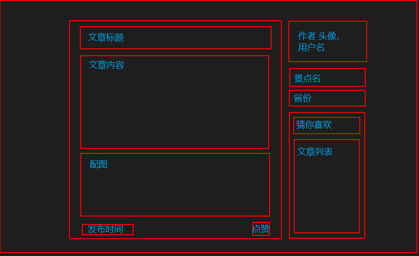
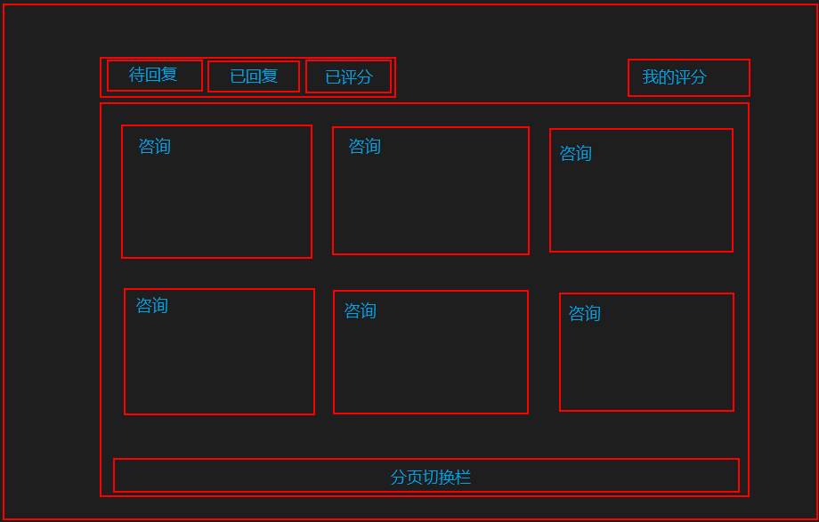
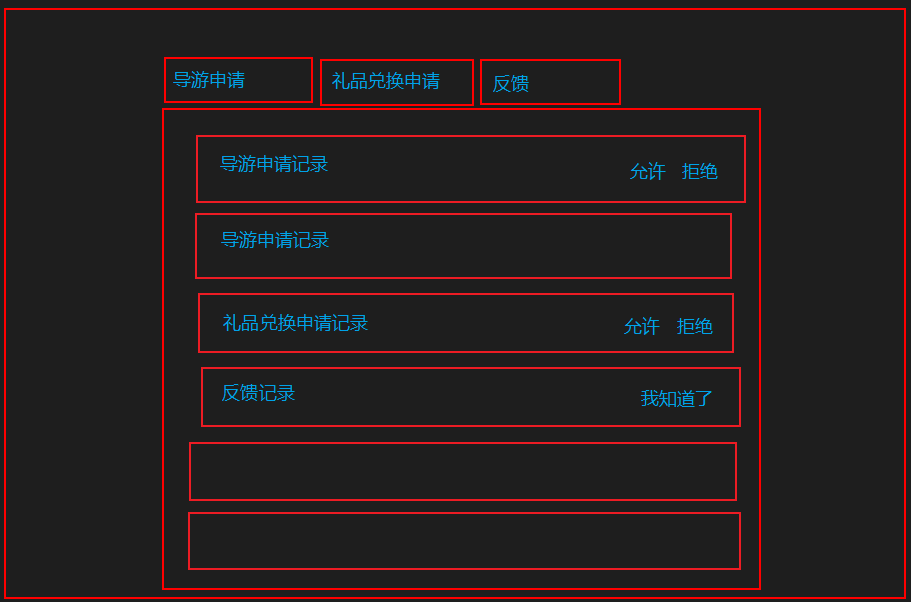

## 业务
- 登录注册
- 分享：用户可以分享自己去旅游的经历，其它用户可以点赞，系统会根据文章的数据给作者一定的金币奖励
- 推荐：用户可以看到其它人的分享，并可以按照地点筛选
- 导游：用户可以申请成为导游，用户可以咨询导游旅游景点相关问题，用户评价后导游会获得金币
- 管理员：审核导游申请，审核举报
- 一起游：用户可以发表自己从哪里出发，想去什么地方，其它用户看到如歌也想去可以和他联系拼团一起去
- 礼品商城：用户可以通过金币兑换礼品
- 经验等级系统：用户通过在平台活跃可以获得一些经验，经验满了升级之后可以获得金币

## 关系模式
- 用户(**账号**, 密码, 用户名, 其它个人信息, 旅游币余额)
- 景点介绍文章(**文章编**号, 文章标题, 景点名, 景点所在省份, 发布时间, 文章内容, *作者账号*)
- 导游(**导游编号**, *用户账号*, 导游评分, 导游简介)
- 导游申请(**申请ID**, 申请时间, *用户账号*, 导游简介)
- 管理员(**管理员编号**, *用户账号*)
- 用户咨询(**咨询ID**, *用户账号*, *导游编号*, 咨询时间, 咨询内容, 导游答复内容, 用户评分, 咨询阶段)
- 拼团申请(**拼团ID**, *发起人账号*, 总人数, 出发地, 目的地, 出发时间, 具体描述信息)
- 参与拼团(***参与人账号*, *拼团ID***)
- 礼品(**礼品编号**, 礼品名称, 礼品描述, 礼品价格)
- 兑换礼品申请(**兑换ID**, *用户账号*, *礼品编号*, 申请时间, 邮寄地址, 申请状态)
- 图片(**图片ID**, 存放路径, 所属位置类型, 所属位置)
- 经验(***用户账号***, 经验值, 经验等级)
- 点赞(***用户账号*, *文章编号***)

## 页面内容
- 登录，注册页面，修改密码(这个太经典了，就不细说了)
- 主页(长页面)
  - 头部
    - 左侧logo
      - 点击logo回主页
    - 右侧个人信息
      - 个人信息鼠标悬浮
    - 个人信息左侧礼品商城入口
  - 轮播图(可以放点鸡汤，广告啥的，没空就不搞了) 
  - 推荐(看其他人的分享)
    - 标题栏
      - 左侧标题 (目前打算把这个模块叫做'周游神州'，直接就叫'推荐'太low了)
      - 右侧筛选器，通过热度，省份筛选的按钮
      - 右侧分享生活(添加文章)
    - 内容
      - 搞成类似腾讯视频那种可以左右滑动的，两排，可以左右滑动
	  - 每个文章显示标题，景点名，省份，点赞数，作者用户名，一点点的内容然后内容显示不下的用省略号
      - 每个文章点进去之后跳转到文章详情页面
  - 导游咨询
    - 标题TAB栏
      - 名气导游
      - 我的咨询
	- 下面内容
      - 名气导游
        - 下面显示导游列表
        - 每个导游显示其用户名，评分，简介
        - 点击导游弹出咨询框
      - 我的咨询
        - 查看自己的咨询记录
        - 每条记录显示导游用户名，咨询时间，(未回复显示未读)(评分后显示评分)
        - 点击记录之后弹出咨询框
      - 咨询框显示内容
		- 未发起阶段
          - 导游编号，导游用户名
          - 咨询内容输入框
          - 提交
        - 发起未回复阶段
          - 导游编号，导游用户名
          - 咨询内容
          - 咨询时间
        - 已回复未评分阶段
          - 导游编号，导游用户名
          - 咨询内容
          - 咨询时间
          - 导游答复内容
          - 评分按钮
        - 已评分阶段
          - 导游编号，导游用户名
          - 咨询内容
          - 咨询时间
          - 导游答复内容
          - 评分
  - 一起游
    - 标题Tab栏
	  - 我参与的一起游
      - 我发起的一起游
    - 内容
      - 拼团列表
  - 页脚
    - 鸡汤，广告
  - 右下角
    - 返回顶部
    - 反馈(这个功能有时间再做，先放着)
    
- 文章详情页面
  - 如图所示
  - 
- 导游页面
  - 主页头部加一个跳转到导游页面的链接
  - 导游页面如图所示
  - 
- 管理员页面
  - 主页头部加一个跳转到管理员页面的链接
  - 管理员页面如图所示
  - 
- 商城页面
  - 待定
